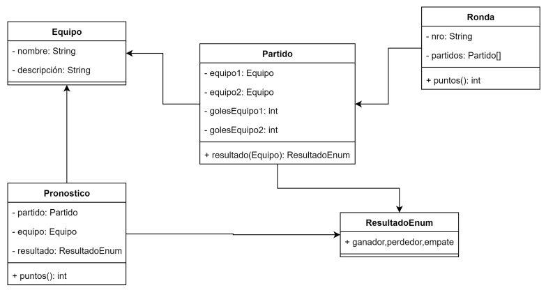

# ENTREGA 1
A partir del esquema original propuesto, desarrollar un programa que lea un archivo de partidos y otro de resultados, el primero correspondiente a una ronda y el otro que contenga los pronósticos de una persona. Cada ronda debe tener una cantidad fija de partidos, por ejemplo 2. 

El programa debe:

● Estar subido en un repositorio de GIT.

● Tomar como argumento 2 rutas a cada archivo que se necesita.

● Al leer las líneas de los archivos debe instanciar objetos de las clases propuestas.

● Debe imprimir por pantalla el puntaje de la persona.

### Importante
Se debe considerar la forma de identificar los partidos de forma unívoca para su correcto procesamiento. Está permitido modificar la estructura del archivo si así lo considera. 
### Ejemplo
Archivo **resultados.csv**
<table style="width: 100%; text-align: center;">
<thead></thead>
<tr><td>Equipo 1</td><td>Cant. goles 1</td><td>Cant. goles 2</td><td>Equipo 2</td></tr>
<tr><td>Argentina</td><td>1</td><td>2</td><td>Arabia Saudita</td></tr>
<tr><td>Polonia</td><td>0</td><td>0</td><td>Mexico</td></tr>
</table>

Archivo **pronostico.csv**
<table style="width: 100%; text-align: center;">
<thead></thead>
<tr><td>Equipo 1</td><td>Gana 1</td><td>Empata</td><td>Gana 2</td><td>Equipo 2</td></tr>
<tr><td>Argentina</td>X<td></td><td></td><td>Arabia Saudita</td></tr>
<tr><td>Polonia</td><td></td><td>X</td><td></td><td>Mexico</td></tr>
</table>

Leyendo los 2 (dos) archivos, y suponiendo que cada resultado acertado suma 1 (un) punto, la salida del programa debe ser: Puntaje = 1
### UML

